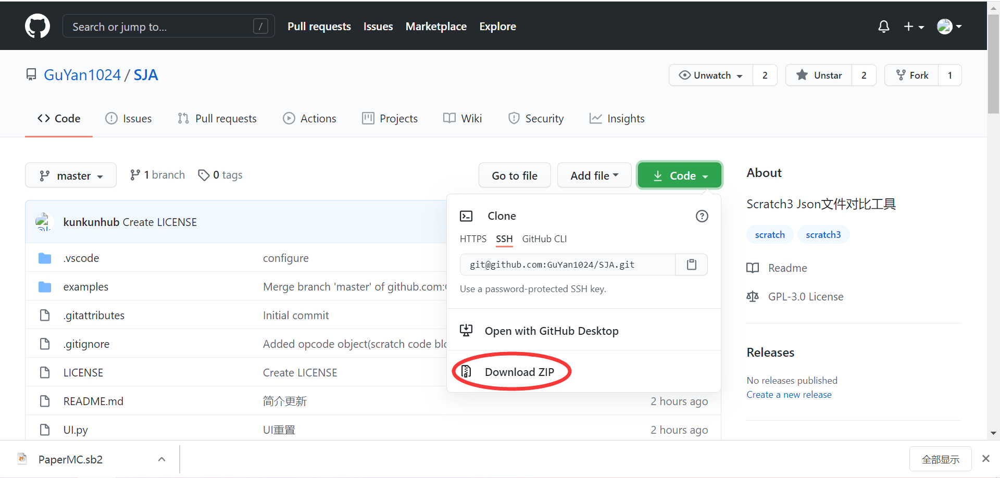
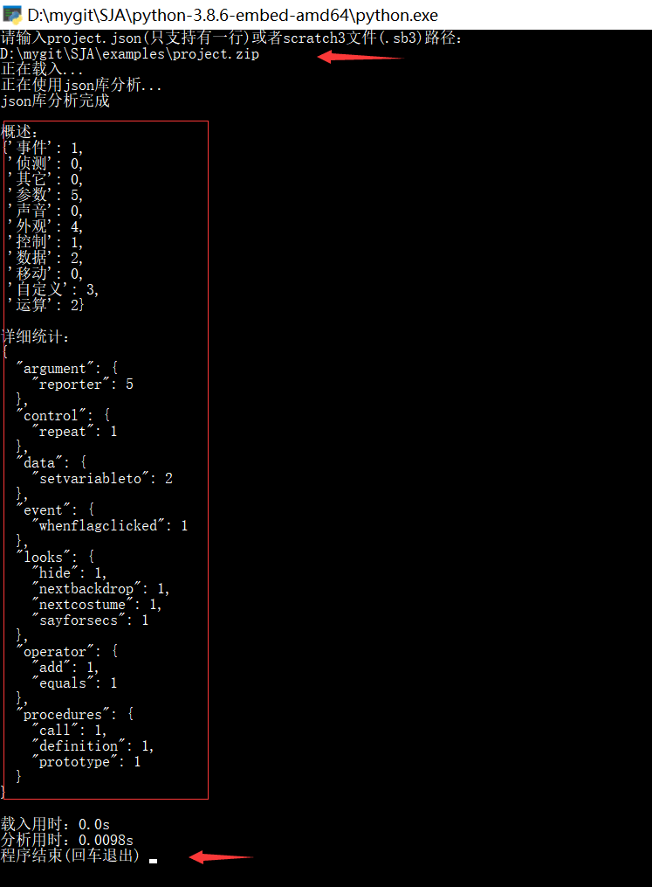

# Scratch Json Analyser
**这个文档的一些执行结果已经过时，将会在不久的未来更新**
更快捷的使用方式：
**[分析器网页版](http://kunkunpaw.pythonanywhere.com/)**  

**sja核心即将弃用，换成pyscratch(3天3夜赶制的结果)，更多关于新核心的信息，在文档末尾有介绍**  

简介

Scratch Json Analyser，简称 SJA，是由孤言发起的针对 Scratch3 Json 文件的比对工具。
原先的[Scratch 版](https://www.aerfaying.com/Projects/512945)在 A 营发布。
为响应用户的文件分析和比对需求，解决原来分析器效率低下的问题，决定采用 Python 来编写这个项目。  


SJA 主要具有代码结构分析和文件相似度分析两大功能。  

#### 方法一
首先需要先[点这里下载](https://github.com/GuYan1024/SJA/archive/master.zip)这个项目。  


在你的计算机上安装(python3)[https://www.python.org/downloads/release/python-391]  
在你的终端（Windows是cmd）里安装依赖模块：  
```shell
cd SJA
pip install -r requirements.txt
```
依赖安装好以后，执行：
```
python cli.py
```
就可以运行了

#### 方法二

https://gitee.com/gitkunkun/sja-bin  
这个仓库把 py 文件打包成了 exe，现在可以直接执行。  
你可以打开上面这个网址，按照说明下载 exe 文件，很方便。

## 使用

这个项目有几个主要的 python 文件和目录：GUI/UI.py, sja.py, cli.py  
<这部分待更新>

### cli

命令行下的工具，现在可以正常使用。
在命令行下输入这个命令就可以运行它：

```shell
python cli.py
```

  
简单吧。  
然后按照提示输入文件路径或 project.json 文件内容就行了。  
速度还是蛮快的。  
<说明信息待更新>

### GUI

这是 GUI 界面，意味着你可以通过点点点的方式分析文件。  
_开发中_

### webapp

网络应用
https://gitee.com/gitkunkun/sjaweb

## 分析器使用方法
<待补充>  

## 原理

scratch3 文件用 zip 格式打开后，会有一个 project.json 文件。  
程序通过分析这个文件，来统计代码块数等信息。

## 关于新核心和新版本
之前的核心写得有些随意，导致随着代码变多，结构也变得混乱起来。  
于是，某核心维护者赶制3天3夜代码，做出了新的解析核心，定名为"pyscratch"。  
pyscratch在制作时，注重了可维护性和扩展性，大量运用了面对对象。  
目前进度和新功能：  
* 基础的代码成分统计       (已完成)  
* 代码段数统计            (已完成)  (新特性)
* 代码变量名、列表名统计 (已完成)  (新特性)
* 角色以及代码块信息全部以对象的形式构建，并且随时可以访问 (已完成) (新特性)
* web版本的饼图更稳定  (待验证) (新特性)  
* 代码相似度测量    (已完成)  (新特性)
* 可视化信息        (正在做)  (新特性)
* 支持从kada社区导入 (已完成)
* web版本引入更多参数和输出 (未完成)
………………  
  随着新核心的到来，项目版本也会进入2.0……

## 主要开发者

[kunkun](https://github.com/kunkunhub) : 核心分析代码、维护人

[sun-xx](https://github.com/sun-xx) : UI

[孤言](https://github.com/GuYan1024) : 菜鸡开发者

## 参与贡献

如果你想一起开发这个项目，有以下几个途径：

1. 提交 pull request，分享你的解决方案
2. 提 issue，告诉我们程序的 bug 和建议

:-)
