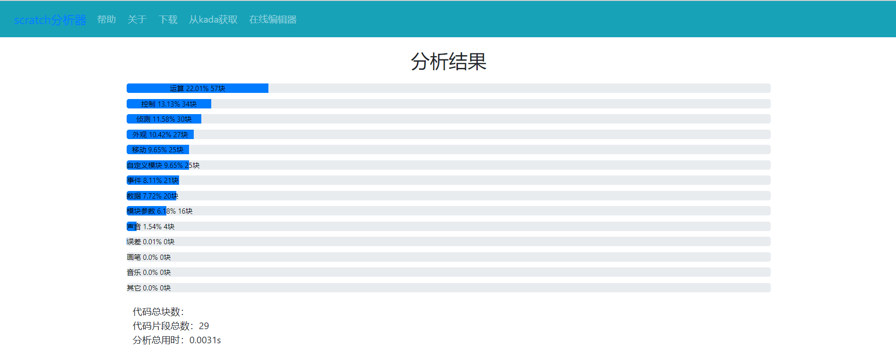
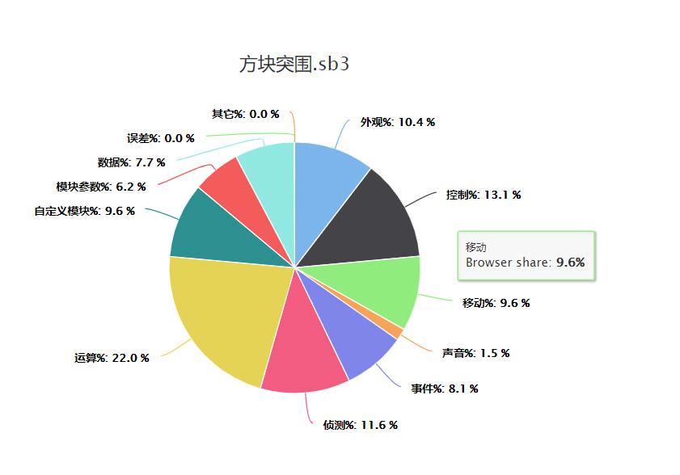

# Scratch Json Analyser
**个别文档的一些执行结果已经过时，将会在不久的未来更新**  
**sja核心已经弃用，换成pyscratch作为分析器核心，请使用pyscratch模块分析**
## 简介

scratch是一个由麻省理工学院开发的一款图形化编程语言(目前在Tiobe排行榜上排第24)，
主要面对青少年。比较著名的社区有[卡搭](https://kada.163.com/)、
[阿儿法营](http://aerfaying.com/)等。

Scratch Json Analyser，简称 SJA，是由孤言发起的针对 Scratch3 Json 文件的比对工具。
原先的[Scratch 版](https://www.aerfaying.com/Projects/512945)在 A营（阿儿法营）发布。
为响应用户的文件分析和比对需求，解决原来分析器效率低下的问题，决定采用 Python 来编写这个项目。  

SJA 主要具有代码结构分析和文件相似度分析两大功能。  

## 小白专区
下载exe文件（无GUI）：https://gitee.com/gitkunkun/sja-bin  
在线体验：http://kunkunpaw.pythonanywhere.com/  

------- 小白止步 -------

## 安装配置
首先确保你有Python3，然后克隆这个项目到本地
### 命令行版启动
在你的终端（Windows是cmd）里安装依赖模块：  
```shell
cd SJA
pip install -r requirements.txt
```
什么，下载速度太慢？换成国内镜像源，并再次尝试下载：
```shell
pip install -r requirements.txt -i https://pypi.douban.com/simple
```
依赖安装好以后，执行：  
```shell
cd TUI
python __main__.py
```
就可以运行了  
推荐使用图形界面哦~  
进入GUI文件夹，运行start.bat  
就能用点点点的方式分析文件了，还原孤言在A营发布的scratch版~  
### Web版
安装依赖：
```
pip install -r web_requirements.txt
```
启动服务器：
```
flask run
```
或者，[在线体验](http://kunkunpaw.pythonanywhere.com/)



## pyscratch的使用
详见doc/tutorial.py
    

## 原理

scratch3 文件用 zip 格式打开后，会有一个 project.json 文件。  
程序通过分析这个文件，来统计代码块数等信息。

## 主要开发者

[kunkun](https://github.com/kunkunhub) : 核心分析代码、维护人

[繁华落尽](https://gitee.com/sun-cheng) : UI

[孤言](https://github.com/GuYan1024) : 发起者

## 参与贡献

如果你想一起开发这个项目，有以下几个途径：

1. 提交 pull request，分享你的解决方案
2. 提 issue，告诉我们程序的 bug 和建议
3. 根据issue和代码里的TODO，尝试解决

:-)
